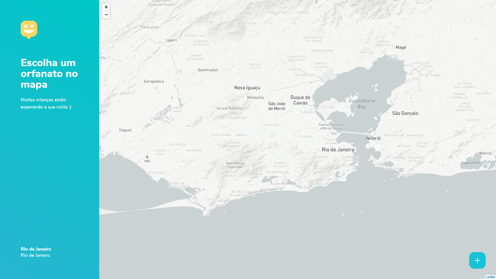

<h1 align="center">
  
</h1>

<p align="center">
  <a href="https://github.com/osflash">
    
  </a>
  <a href="https://github.com/osflash/NLW3-web">
    
  </a>
  <a href="https://github.com/osflash/NLW3-web/commits/master">
    
  </a>
  <a href="https://github.com/osflash/NLW3-web/issues">
    
  </a>
  <a href="LICENSE.md">
    
  <a>
</p>

<p align="center">
  <a href="#-tecnologias">Tecnologias</a>&nbsp;&nbsp;&nbsp;|&nbsp;&nbsp;&nbsp;
  <a href="#-exemplos">Exemplos</a>&nbsp;&nbsp;&nbsp;|&nbsp;&nbsp;&nbsp;
  <a href="#-api">Api</a>&nbsp;&nbsp;&nbsp;|&nbsp;&nbsp;&nbsp;
  <a href="#-instalação">Instalação</a>&nbsp;&nbsp;&nbsp;|&nbsp;&nbsp;&nbsp;
  <a href="#-licença">Licença</a>
</p>

---

## 🚀 Tecnologias
## 🎨 Exemplos

<h1 align="center">
  <a href=".github/home.png">
    
  </a>
  <a href=".github/map.png">
    
  </a>
</h1>


Esse projeto foi desenvolvido com as seguintes tecnologias:

- [NextJS](https://nextjs.org/)
- [Node.js](https://nodejs.org/en/)
- [Typescript](https://www.typescriptlang.org/)
- [ESLint](https://eslint.org/)
- [Prettier](https://prettier.io/)
- [Husky](https://github.com/typicode/husky)
- [Jest](https://jestjs.io/)
- [ReactJS](https://reactjs.org)
- [React Leaflet](https://react-leaflet.js.org/)

## ⚙ Implante o seu próprio

Implante o exemplo usando [Vercel](https://vercel.com):

[](https://vercel.com/import/project?template=https://github.com/osflash/NLW3-web)

## ⚙ Instalação

Execute via [npm](https://docs.npmjs.com/cli/init) ou [Yarn](https://yarnpkg.com/lang/en/docs/cli/create/) para iniciar o projeto:

```bash
npm install
npm run dev

npm run typeorm migration:run

# ou

yarn install
yarn dev

yarn typeorm migration:run
```

Implante-o na nuvem com [Vercel](https://vercel.com/import?filter=next.js&utm_source=github&utm_medium=readme&utm_campaign=next-example) ([Documentation](https://nextjs.org/docs/deployment)).
## 📄 Api

```bash
/api/orphanages     # GET
/api/orphanages/1   # GET

/api/orphanages     # POST
```


## 🧾 Licença

Esse projeto está sob a licença MIT. Veja o arquivo [LICENSE](LICENSE.md) para mais detalhes.
